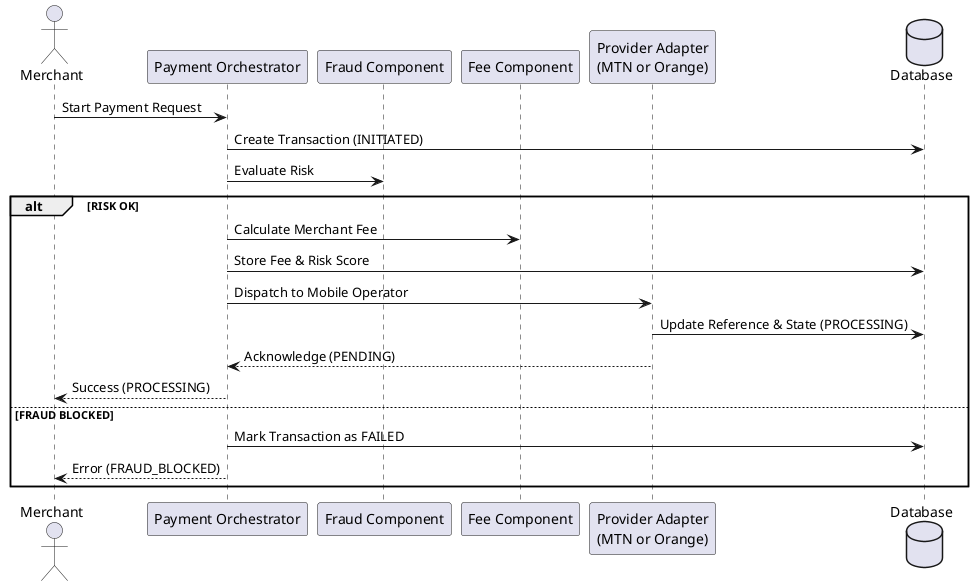

# Payment Component Documentation

Welcome to the Payment Component documentation! This guide is designed for developers who are new to the Payam codebase and need to understand how the payment flow is orchestrated and secured.

## Architecture Overview

Payam uses a **Port & Adapter** architecture. The core logic (the Orchestrator) stays provider-neutral, while specific adapters (MTN, Orange) handle the messy details of interacting with different mobile money operators.

### Component Map
The payment flow involves five primary packages:

1.  [**Payment Orchestrator (`payment`)**](./payment.md): The "brain" that coordinates the entire flow.
2.  [**Fee Component (`fee`)**](./fee.md): Calculates how much to charge the merchant.
3.  [**Fraud Component (`fraud`)**](./fraud.md): Protects the system from risky or fraudulent transactions.
4.  [**MTN Adapter (`mtn`)**](./mtn.md): The bridge to MTN Mobile Money.
5.  [**Orange Money Adapter (`orange`)**](./orange.md): The bridge to Orange Money.

## The Big Picture Flow

## System Integrity & Security

-   **Idempotency**: Every payment request is tracked by an `idempotencyKey`. If a merchant retries a request, we return the same result instead of double-charging.
-   **No Open Connections**: We never hold a database connection open while waiting for a provider (MTN/Orange) to respond. This prevents the connection pool from being exhausted.
-   **Fraud Gate**: Every payment must pass through the fraud component *before* it can proceed to a provider.
-   **Event Logging**: Every state change (e.g., `INITIATED` -> `PROCESSING`) is logged in the `event_log` table for auditing and troubleshooting.

---

### How to use this guide?
If you're starting a new task:
-   Read [**Payment Orchestrator**](./payment.md) to understand the high-level flow.
-   If you're working on provider-specific logic, read [**MTN**](./mtn.md) or [**Orange**](./orange.md).
-   If you're adjusting fees or security, check [**Fee**](./fee.md) or [**Fraud**](./fraud.md).
