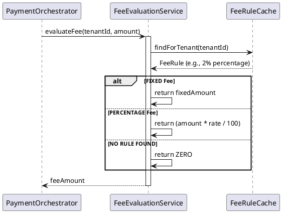

# Fee Component (`com.softropic.payam.fee`)

The Fee Component evaluates the transaction fees applicable to each payment. It allows the system to support various merchant fee structures (fixed or percentage-based) while ensuring accurate revenue calculation.

## Role & Purpose
- **Revenue Calculation**: Determines the amount the merchant pays for using the service.
- **Dynamic Configuration**: Rules are stored in the database and cached for fast lookups.
- **Consistency**: Ensures every payment is tagged with a `fee_amount` and a `fee_rule_id` for auditing.

## Key Service: `FeeEvaluationService`
This service handles the calculation of the fee based on the merchant (tenant) and the transaction amount.

### Fee Calculation Flow

## Dependencies
- **Inbound**:
    - `PaymentOrchestrator`: Invoked during the initiation flow.
    - `FeeRuleAdminResource`: Admin interface for managing fee rules.
- **Outbound**:
    - `FeeRuleCache`: Retrieves the active fee rules for each tenant.
    - `FeeRuleRepository`: Underlying database storage for fee rules.

## Triggering Mechanisms
- **`evaluateFee(tenantId, amount)`**: Triggered by the `PaymentOrchestrator` *after* the initial transaction is created but *before* the provider call is made. This ensures the fee is calculated and stored regardless of the payment outcome.

## Junior Dev Tips
- **Fail-Open Policy**: If no fee rule is found for a merchant, the system returns `BigDecimal.ZERO` as the fee. This prevents blocking a payment just because a fee isn't configured.
- **Caching**: Fee rules are cached (`FeeRuleCache`). If you update a fee rule in the database, it may take a few moments for the cache to refresh (or it may need an explicit reload depending on the implementation).
- **Rounding**: Percentage fees use `RoundingMode.HALF_UP` with 2 decimal places to ensure consistent currency calculations.
