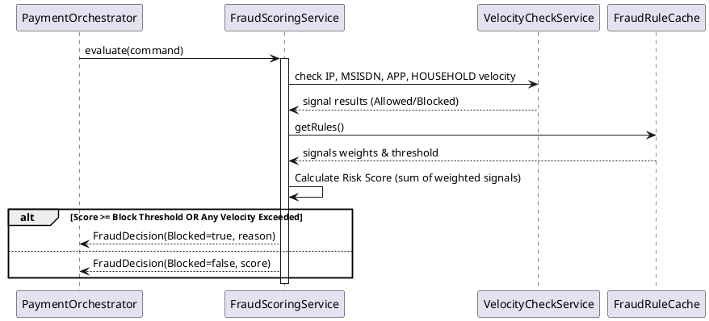

# Fraud Component (`com.softropic.payam.fraud`)

The Fraud Component provides a security layer that evaluates each payment for potential risk. It prevents fraudulent activity (like SIM-sharing patterns or high-frequency attacks) by scoring transactions and blocking them before they reach the mobile operators.

## Role & Purpose
- **Prevention**: Blocks high-risk transactions before any money moves.
- **Velocity Tracking**: Monitors how often an IP, an MSISDN (phone number), or an application is used.
- **Risk Scoring**: Combines different "fraud signals" into a weighted score (0–100).
- **Blocking**: Automatically rejects transactions that exceed a configured threshold.

## Key Service: `FraudScoringService`
This service evaluates four main signals for each payment:
1. **IP Velocity**: Too many payments from the same client IP.
2. **MSISDN Velocity**: Too many payments to the same phone number.
3. **App Velocity**: Too many payments from the same tenant application.
4. **MSISDN Household**: SIM-sharing pattern (using the first 9 digits of the phone number).

### Fraud Evaluation Flow

## Dependencies
- **Inbound**:
    - `PaymentOrchestrator`: Invoked before the transaction is sent to MTN or Orange.
- **Outbound**:
    - `VelocityCheckService`: Interacts with Redis to track and check transaction frequencies.
    - `FraudRuleCache`: Provides the rules, weights, and blocking thresholds.
    - `FraudRuleRepository`: Underlying database storage for fraud rules.

## Triggering Mechanisms
- **`evaluate(command)`**: Triggered by the `PaymentOrchestrator` during the `initiate()` flow. This is a critical security gate: if the decision is to block, the flow stops immediately.

## Junior Dev Tips
- **Velocity Violations vs. Score**: A single velocity violation (e.g., hitting the MSISDN limit) will block the payment immediately, regardless of the overall risk score.
- **Fail-Open Policy**: If a rule or signal is unknown, it's treated as "not violated." This ensures that a minor configuration error doesn't accidentally block all payments.
- **Redis Dependency**: The velocity checks are backed by Redis. This allows for extremely fast counting across multiple application instances.
- **Blocking Threshold**: The default block threshold is 70. If the sum of weights for triggered signals reaches this, the payment is blocked.
