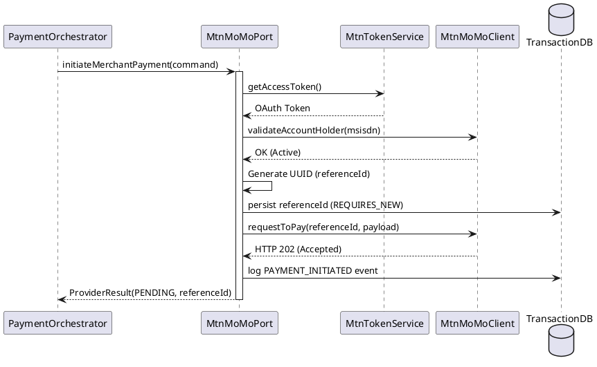

# MTN Adapter (`com.softropic.payam.mtn`)

The MTN Adapter handles communication with the MTN Mobile Money (MoMo) API. It translates Payam's internal payment commands into MTN-specific requests and processes callbacks from MTN to update transaction statuses.

## Role & Purpose
- **Provider Interface**: Implements the `MobileMoneyPort` interface for the MTN provider.
- **Protocol Translation**: Handles MTN's specific authentication (API keys/User IDs) and data formats.
- **Resilience**: Implements circuit breakers and retries specifically for the MTN API to prevent one provider's failure from affecting others.
- **Webhook Handling**: Processes asynchronous callbacks from MTN when a user confirms or rejects a payment on their phone.

## Key Service: `MtnMoMoPort`
This is the core implementation of the MTN adapter.

### Payment Initiation Flow

## Dependencies
- **Inbound**:
    - `PaymentOrchestrator`: For payment initiation.
    - `MtnCallbackController`: For processing incoming webhooks.
- **Outbound**:
    - `MtnMoMoClient`: Feign client that performs the actual HTTP calls to MTN.
    - `MtnTokenService`: Manages OAuth access tokens for the MTN API.
    - `EventLogService`: Logs state transitions and provider interactions.
    - `TransactionRepository`: Stores the MTN-generated `referenceId`.

## Triggering Mechanisms
- **`initiateMerchantPayment(cmd)`**: Triggered by the `PaymentOrchestrator` when a payment is routed to MTN.
- **`processCallback(payload)`**: Triggered by the `MtnCallbackController` when MTN sends an asynchronous update to our system.
- **`getTransactionStatus(providerRef)`**: Triggered by the status poller if we don't receive a callback within a certain time.
- **`validateSubscriber(msisdn)`**: Used by the platform to check if a phone number is a valid MTN account before trying to charge it.

## Junior Dev Tips
- **Pre-API Persistence**: In MTN, we generate the `referenceId` (a UUID) *before* making the API call. This is different from Orange, where the provider returns the reference to us. We save it early so that if the system crashes right after the API call, we still have the reference to check the status later.
- **Webhook Authenticity**: MTN callbacks are validated by checking if the `notifToken` matches and by whitelisting the source IP addresses.
- **Circuit Breaker**: The `@CircuitBreaker(name = "mtn")` annotation protects the system. If the MTN API is down or slow, the circuit will open, and we'll fail-fast for subsequent MTN requests without overloading their servers or our own.
- **MSISDN Formatting**: MTN expects phone numbers *without* the leading `+` (e.g., `237...`). The adapter handles this stripping automatically.
