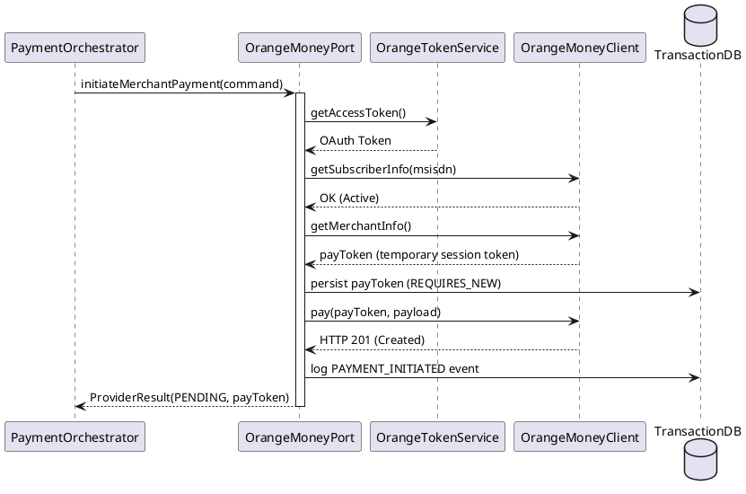

# Orange Money Adapter (`com.softropic.payam.orange`)

The Orange Money Adapter manages the connection to Orange Money API. It enables payments by interacting with Orange's Merchant Payment (MP) endpoints and handles incoming webhooks to complete the payment lifecycle.

## Role & Purpose
- **Provider Interface**: Implements the `MobileMoneyPort` interface for the Orange provider.
- **Protocol Translation**: Handles Orange's specific authentication (consumer key/secret) and data formats.
- **Resilience**: Implements circuit breakers and retries specifically for the Orange API.
- **Webhook Handling**: Processes asynchronous callbacks from Orange when a user confirms or rejects a payment on their phone.

## Key Service: `OrangeMoneyPort`
This is the core implementation of the Orange Money adapter.

### Payment Initiation Flow

## Dependencies
- **Inbound**:
    - `PaymentOrchestrator`: For payment initiation.
    - `OrangeWebhookController`: For processing incoming webhooks.
- **Outbound**:
    - `OrangeMoneyClient`: Feign client that performs the actual HTTP calls to Orange.
    - `OrangeTokenService`: Manages OAuth access tokens for the Orange API.
    - `EventLogService`: Logs state transitions and provider interactions.
    - `TransactionRepository`: Stores the Orange-generated `payToken`.

## Triggering Mechanisms
- **`initiateMerchantPayment(cmd)`**: Triggered by the `PaymentOrchestrator` when a payment is routed to Orange.
- **`processWebhook(payload, notifToken)`**: Triggered by the `OrangeWebhookController` when Orange sends an asynchronous update.
- **`getTransactionStatus(providerRef)`**: Triggered by the status poller if we don't receive a callback within a certain time.
- **`validateSubscriber(msisdn)`**: Checks if a phone number is an active Orange Money subscriber.

## Junior Dev Tips
- **The `payToken`**: Unlike MTN, Orange requires you to fetch a *temporary session token* (`payToken`) for every single payment. This token is what we use as the `providerRef` and is essential for correlating webhooks.
- **Token Expiry**: The `payToken` expires after a short period (configurable, e.g., 10 minutes). If it expires before a callback is received, we must stop polling.
- **Webhook Correlation**: Orange webhooks only send back the `payToken`. This is why we must persist it immediately after the `getMerchantInfo` call.
- **MSISDN Formatting**: Orange expects phone numbers *without* the country code (e.g., `692...`). The adapter handles this by stripping the `+237` prefix automatically.
- **Concurrent Safety**: We use pessimistic locking (`PESSIMISTIC_WRITE`) during status checks to prevent a race condition between the background poller and the incoming webhook.
