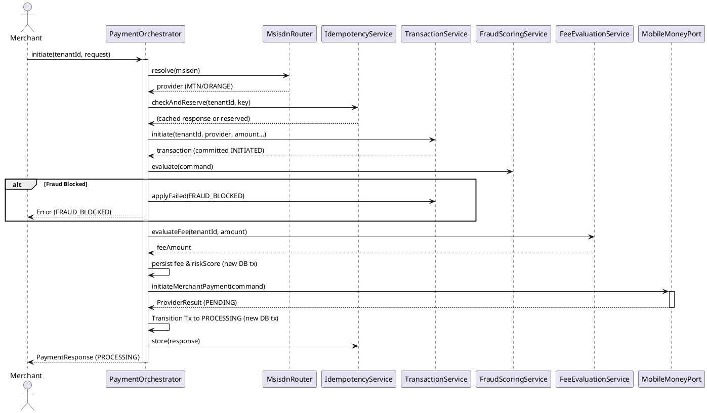

# Payment Orchestrator (`com.softropic.payam.payment`)

The Payment Orchestrator is the central hub of the Payam system. It coordinates the lifecycle of a payment from initial request to provider dispatch, ensuring idempotency, fraud checks, fee evaluation, and transaction state management.

## Role & Purpose
- **Central Coordinator**: Wires together routing, idempotency, transactions, and provider ports.
- **State Manager**: Orchestrates the state transitions of a transaction (e.g., `INITIATED` -> `PROCESSING`).
- **Integrity Guard**: Ensures that payments are not double-processed (idempotency) and are properly logged.
- **Performance Optimized**: Carefully manages database connections by performing outbound network calls (to MTN/Orange) outside of database transactions.

## Key Service: `PaymentOrchestrator`
The `PaymentOrchestrator.initiate()` method is the entry point for all mobile money payments.

### Interaction Flow

## Dependencies
- **Inbound**: Called by `PaymentResource` (REST API).
- **Outbound**:
    - `MsisdnRouter`: To determine if it's an MTN or Orange number.
    - `IdempotencyService`: To prevent duplicate payments.
    - `TransactionService` / `TransactionRepository`: For database persistence.
    - `FraudScoringService`: To block risky transactions.
    - `FeeEvaluationService`: To calculate merchant fees.
    - `MtnMoMoPort` / `OrangeMoneyPort`: To talk to the actual mobile operators.
    - `PaymentMetricsService`: To track success/failure rates.

## Triggering Mechanisms
- **`initiate(tenantId, request)`**: Invoked when a merchant calls the `/v1/payments` API. This is the main "happy path" trigger.
- **`applyFailed(...)`**: Triggered internally when an error occurs during initiation (e.g., provider down, fraud block, subscriber inactive).

## Junior Dev Tips
- **No `@Transactional` on `initiate()`**: We don't want to hold a DB connection while waiting for MTN/Orange to respond. This prevents the system from locking up under high load.
- **State Machine**: Transactions follow a strict state machine. You cannot jump from `INITIATED` directly to `SUCCESS`. The orchestrator handles the `INITIATED` -> `PROCESSING` jump.
- **Idempotency**: Always use the `idempotencyKey` provided by the merchant. If they retry the same request, the orchestrator will return the same response without charging the customer again.
