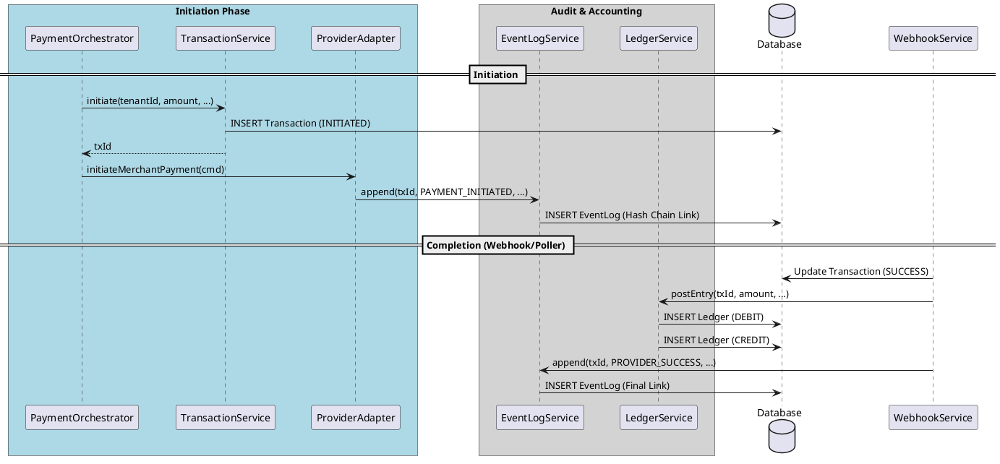

# Transaction Services: Deep Dive

This document provides a comprehensive technical overview of the three core services that form the "Triple-Store" of the Payam gateway: **TransactionService**, **EventLogService**, and **LedgerService**.

Together, these services ensure that every payment is identifiable, auditable, and financially reconciled.

---

## 1. Big Picture: The "Triple-Store" Architecture

Every payment in Payam is recorded in three distinct but linked stores:

| Service | Store Type | Purpose | Consistency Guarantee |
| :--- | :--- | :--- | :--- |
| **TransactionService** | **State Store** | Current lifecycle status of the payment. | Pessimistic Locking (`FOR UPDATE`) |
| **EventLogService** | **Audit Store** | Immutable history of *how* and *why* status changed. | SHA-256 Hash Chaining |
| **LedgerService** | **Financial Store** | Accounting records of money movement. | Balanced Double-Entry (DEBIT/CREDIT) |

---

## 2. TransactionService

### Role
The **TransactionService** is the "Birth Registry" for payments. Its primary role is to create the initial identity of a transaction and manage its high-level state.

### When is it invoked?
It is invoked at the very beginning of the `PaymentOrchestrator.initiate()` flow, before any provider (Orange/MTN) interaction occurs.

### Key Responsibilities
- **Identity Generation**: Generates a globally unique `transactionId` (UUID).
- **Context Linking**: Captures the technical `traceId` from the distributed tracing context (Micrometer/OTel) and persists it.
- **Initial State**: Sets the transaction to `INITIATED`.

### Querying & Investigation
- **Repository**: `TransactionRepository`
- **Primary Keys**: `transactionId` (Internal UUID) and `externalReference` (Merchant-provided ID).
- **Investigation Info**: Use this to find the current status, provider-specific references (`payToken`, `providerRef`), and technical metadata like `riskScore` or `deviceFingerprint`.

---

## 3. EventLogService

### Role
The **EventLogService** provides a tamper-evident audit trail. It doesn't just store "what" happened, but ensures that the history cannot be modified after the fact without detection.

### The Hash Chain Mechanism
Every event entry contains an `event_hash`. This hash is computed from:
`SHA256(transactionId | eventType | statusFrom | statusTo | actor | previousHash)`

The first event for a transaction uses `"GENESIS"` as the `previousHash`. Each subsequent event "chains" to the hash of the one before it.

### When is it invoked?
1.  **Initiation**: When the adapter successfully talks to the provider (e.g., `ORANGE_ADAPTER` logs `PAYMENT_INITIATED`).
2.  **Provider Interaction**: When a provider call fails (`PROVIDER_FAILED`).
3.  **Polling**: When the status poller finds an update (`ORANGE_POLLER` or `MTN_POLLER`).
4.  **Webhook**: When a final confirmation is received (`WEBHOOK_DOUBLE_CHECK`).

### Querying & Investigation
- **Repository**: `PaymentEventLogRepository`
- **Integrity Check**: Call `eventLogService.verifyChain(transactionId)`. If it returns `false`, the database records for that transaction have been tampered with.
- **Investigation Info**: Look here to see the exact sequence of events. If a transaction is `FAILED`, the `metadata` column in the event log often contains the raw error code from the provider.

---

## 4. LedgerService

### Role
The **LedgerService** is the financial system of record. It follows strict double-entry bookkeeping principles to ensure money is always balanced.

### The Balanced Entry Model
Every time money "moves" (only upon `SUCCESS`), the service posts exactly two entries sharing the same `entry_group_id`:

| Account | Direction | Purpose |
| :--- | :--- | :--- |
| `CUSTOMER_WALLET` | **DEBIT** | Represents money leaving the customer's mobile wallet. |
| `PROVIDER_CLEARING` | **CREDIT** | Represents money being "held" by the provider for Payam. |

### When is it invoked?
It is invoked **ONLY** when a transaction reaches a terminal `SUCCESS` state. This usually happens in the `WebhookTransitionService` after a successful double-check.

### Querying & Investigation
- **Repository**: `LedgerEntryRepository`
- **Investigation Info**: If a transaction is `SUCCESS` in the Transaction store, there **MUST** be exactly two matching entries in the Ledger store. If they are missing, it indicates a partial failure in the processing logic (e.g., a crash between state update and ledger posting).

---

## 5. Lifecycle Flow Diagram

---

## 6. Incident Investigation Guide

When investigating a "stuck" or disputed transaction, follow this checklist:

1.  **Find the Trace**: Get the `transactionId` from the merchant. Use it to find the `traceId` in the `Transaction` table.
2.  **Verify the Chain**: Run `EventLogService.verifyChain()`. If it fails, escalate immediately (potential database intrusion).
3.  **Trace the Timeline**:
    -   If the last event is `PAYMENT_INITIATED` but the status is still `PROCESSING`, check the **Status Poller** logs for that `transactionId`.
    -   If the status is `SUCCESS` but there are no **Ledger** entries, a manual reconciliation is required to book the funds.
4.  **Extract Provider Errors**: If the transaction `FAILED`, look at the `metadata` column of the `PROVIDER_FAILED` event in the `PaymentEventLog`. It contains the raw JSON response or error code from Orange/MTN.
5.  **Cross-Reference Logs**: Use the `traceId` to search the application logs (Kibana/Grafana) for the full HTTP request/response cycle with the provider.
