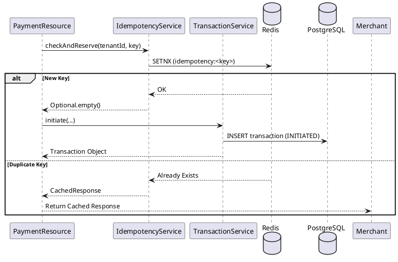
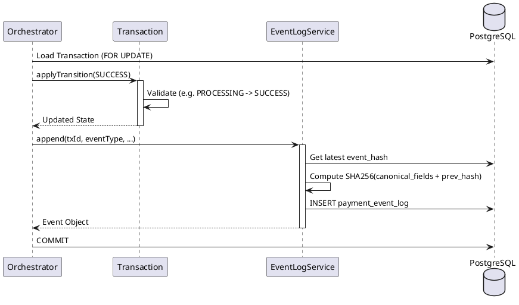

# Transaction Component

The Transaction component is the **System of Record** for the entire gateway. It manages the lifecycle, state transitions, audit trails, and financial ledger for every payment processed by Payam.

## Role
- **State Management**: Enforces a strict state machine for transaction transitions (e.g., you can't move from `INITIATED` to `SUCCESS` without passing through `PROCESSING`).
- **Idempotency**: Ensures that retried requests from merchants (using the same key) do not result in double charges.
- **Audit Integrity**: maintains a tamper-evident event log using SHA-256 hash chaining.
- **Financial Ledger**: Records double-entry bookkeeping records for every successful movement of money.

## Key Sub-Services

### 1. TransactionService
Responsible for the birth of a transaction. It generates the unique `transactionId`, captures the `traceId` from the distributed tracing context, and persists the initial `INITIATED` state.

### 2. IdempotencyService
A high-performance guard that uses Redis (with a PostgreSQL fallback) to track `idempotencyKey` values. 
- If a key is new, it "reserves" it.
- If a key is seen again within 24 hours, it returns the original cached response.

### 3. EventLogService
Every time a transaction changes state, an event is recorded. To ensure these logs aren't tampered with, each log entry contains a hash of itself plus the hash of the previous entry (`previous_hash`). This creates a "blockchain-like" integrity chain.

### 4. LedgerService
Handles the accounting. When a payment is successful, it records a balanced double-entry pair:
- **DEBIT**: `CUSTOMER_WALLET`
- **CREDIT**: `PROVIDER_CLEARING`

---

## Core Flows

### 1. Transaction Initiation Flow
This flow happens when a merchant first calls the gateway.

### 2. State Transition & Audit Flow
This flow is triggered by the Orchestrator or Webhook handlers when provider updates arrive.

---

## The State Machine
The `TransactionStatus` enum defines the allowed paths. Attempting an invalid move (like `SUCCESS` -> `FAILED`) will throw an `IllegalStateTransitionException`.

| From State | Allowed To States |
| :--- | :--- |
| `INITIATED` | `AUTH_PENDING`, `FAILED` |
| `AUTH_PENDING` | `AUTHORIZED`, `FAILED` |
| `AUTHORIZED` | `PROCESSING`, `FAILED` |
| `PROCESSING` | `SUCCESS`, `FAILED`, `REVERSED` |
| `SUCCESS` / `FAILED` | *None (Terminal)* |

---

## Dependencies

### Who depends on Transaction?
- **Payment Orchestrator**: Uses it to create and advance transactions.
- **Webhook Component**: Uses it to finalize transactions based on provider callbacks.
- **Admin Dashboard**: Queries the repositories to show transaction history and metrics.

### What does Transaction depend on?
- **PostgreSQL**: For persistent storage of transactions, logs, and ledger.
- **Redis**: For fast idempotency checks.
- **Micrometer Tracing**: To link transactions to technical trace IDs.

## Junior Dev Tips
- **Pessimistic Locking**: When updating a transaction status, always use `transactionRepository.findByTransactionIdForUpdate()`. This prevents two threads (like a poller and a webhook) from corrupting the state simultaneously.
- **JSON Metadata**: The `metadata` column in `payment_event_log` is a Postgres `jsonb` type. When appending logs, ensure your metadata string is a valid JSON fragment (e.g., use double quotes for simple strings).
- **Audit Verification**: You can verify the integrity of any transaction's history by calling `eventLogService.verifyChain(transactionId)`.
