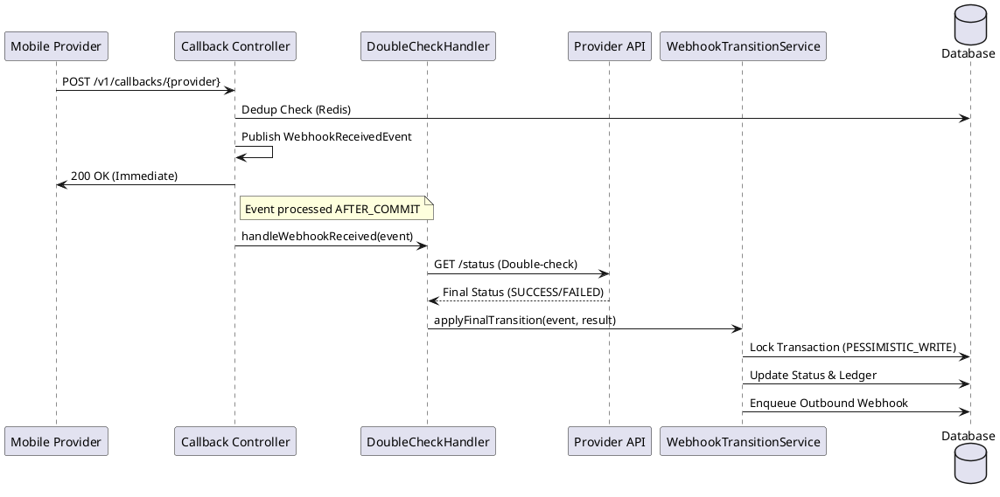
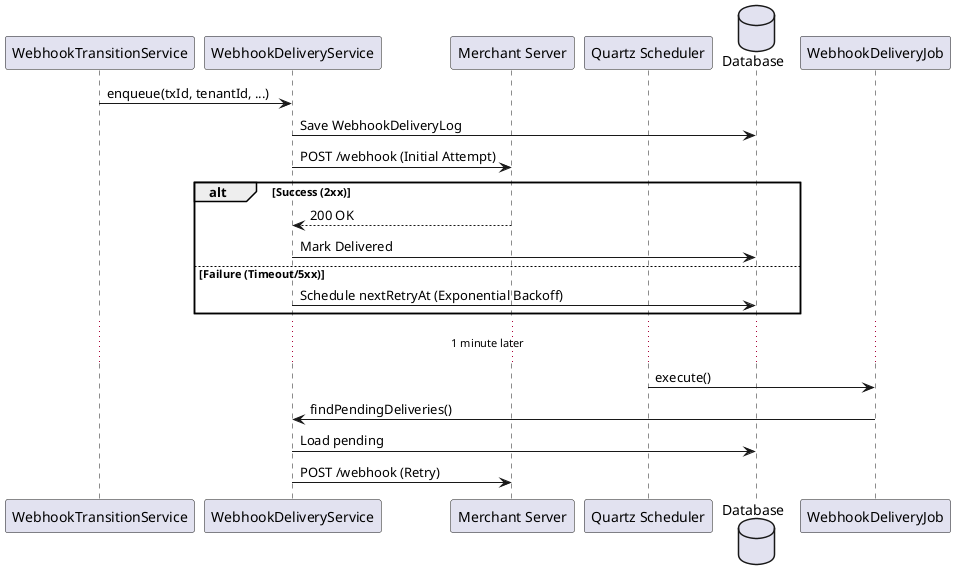

# Webhook Component

The Webhook component is responsible for handling payment status notifications from providers (Inbound) and notifying merchants about terminal transaction states (Outbound). It ensures high reliability through a "double-check" pattern and persistent retry logic.

## Role
- **Verification**: Validates inbound notifications by explicitly querying the provider's API.
- **State Management**: Orchestrates transaction state transitions triggered by external events.
- **Merchant Notification**: Sends signed HTTP POST requests to merchant-configured endpoints.
- **Durability**: Guarantees delivery using a Quartz-based retry mechanism with exponential backoff.

## Key Flows

### 1. Inbound Double-Check Flow
When a provider (Orange/MTN) sends a callback, we do not trust the payload directly. Instead, we use it as a trigger to pull the latest status from the provider's "source of truth".

### 2. Outbound Delivery & Retry Flow
Once a transaction reaches a terminal state (`SUCCESS` or `FAILED`), we notify the merchant. If the merchant's server is down, we retry.

## Security
- **Inbound**: 
    - IP Whitelisting (enforced by Interceptors).
    - Optional HMAC-SHA256 verification if a secret is configured for the provider.
- **Outbound**:
    - Every payload is signed using **HMAC-SHA256**.
    - The signature is sent in the `X-Payam-Signature` header as `sha256=<hex_hash>`.
    - Merchants use their `webhookSecret` to verify the payload's authenticity.

## Dependencies

### Who depends on Webhook?
- **Provider Modules (`orange`, `mtn`)**: They publish the `WebhookReceivedEvent` that starts the double-check flow.
- **Payment Orchestrator**: Implicitly depends on the state transitions performed here to conclude the transaction lifecycle.

### What does Webhook depend on?
- **Persistence**: `TransactionRepository`, `WebhookDeliveryLogRepository`.
- **Infrastructure**: `Quartz` (for scheduling), `RestTemplate` (for HTTP calls).
- **Core Services**: `LedgerService` (to book money), `EventLogService` (to record transitions).
- **Security**: `TenantRepository` (to fetch merchant URLs and signing secrets).

## Getting Started for Developers
- **Adding a new event type**: Update `OutboundWebhookPayload` and ensure `WebhookTransitionService` passes the correct `eventType`.
- **Debugging Delivery**: Check the `main.webhook_delivery_log` table. It contains the raw HTTP status codes and attempt counts for every outbound request.
- **Configuration**: Retry intervals and max attempts are managed in `WebhookDeliveryService`. Quartz job frequency is in `WebhookSchedulerConfig`.
